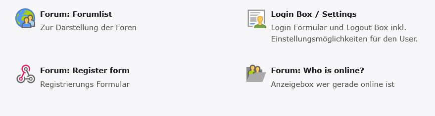

# Forum Manager (TYPO3 Community Extension)

With the ForumMan extension, you can easily create a fully featured forum on your TYPO3 website. Users can register, create posts, upload avatars, and interact in discussions. The extension also supports real-time online user tracking and customizable frontend plugins.

## Features

- User registration and login with profile management

- Forum categories and threads

- Posts with avatars and user references

- Online user tracking (middleware updates last activity)

- Frontend plugins for forum list, single forum, posts, and “Who is online”

- Ajax updates for online users (plugin cache safe)

- Flexible templates (Fluid) and styling options

- TYPO3 13 LTS & 14 LTS compatible

- Composer & Classic installation supported

# Installation

## Installation via Composer (recommended)
Install the extension using Composer:
`composer require lanius/forumman`

### After installation:

1. Log in to the TYPO3 backend
2. Go to Admin Tools → Extensions
3. Activate the extension Job Manager
4. Add the extension to the Site Settings to enable site-specific configuration
5. Run the database updates via the Upgrade Wizard if required

# Setup & Configuration

- Create one or more folders in the page tree where forum posts and user data will be stored.

- Go to Site Settings and add a site set for ForumMan (optional, for plugin configuration).

- Create pages in the page tree where you want to display the forum and add the respective ForumMan plugins:

* Forum list
Loginbox and settings
Register form
Who is online

- Configure each plugin via the Flexform settings to select the storage folder, templates, and display options.

- Optionally, configure the FAL storage for user avatars in the plugin settings.

